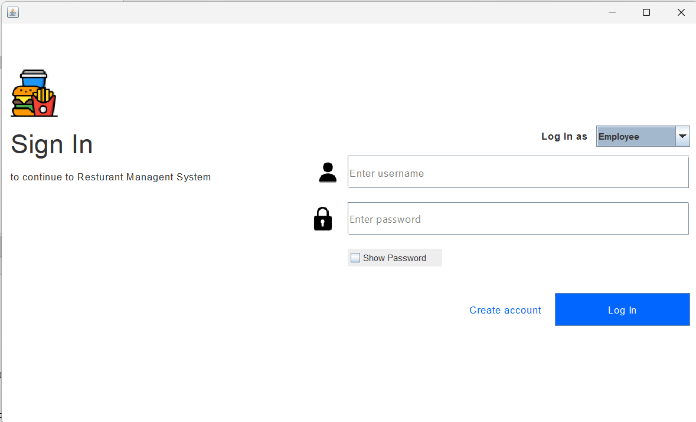
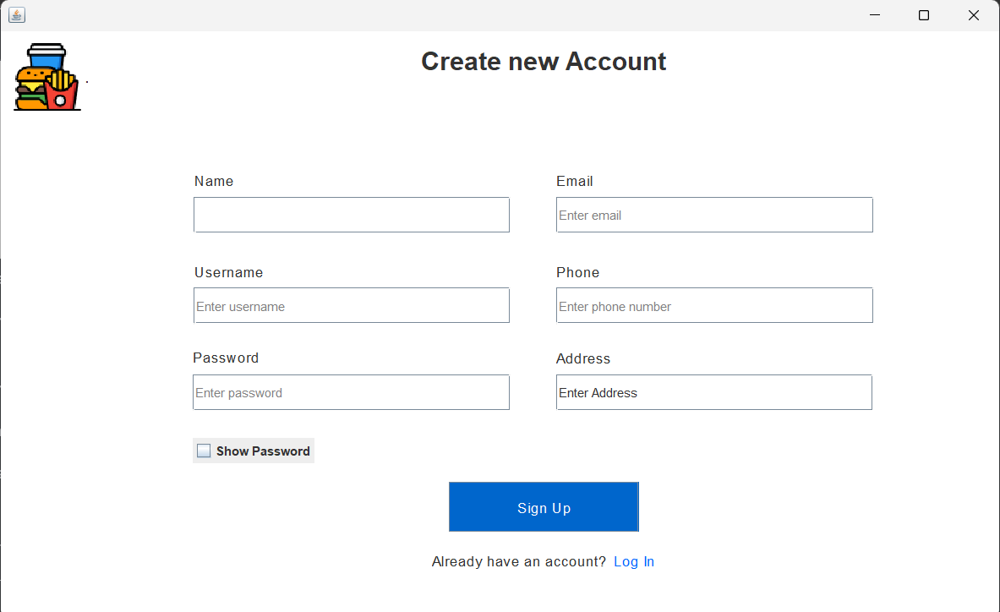

# Restaurant Management System
## Overview

The Restaurant Management System is a Java-based application designed to streamline the operations of a restaurant. It allows users to manage menus, place orders, track customers, and generate reports. The system uses MySQL for data storage and Java Swing with WindowBuilder for the graphical user interface (GUI).

This project demonstrates the use of Object-Oriented Programming (OOP) principles, recursive methods , control structures , and database connectivity in Java. It also includes a login form for user authentication and ensures modularity by using multiple Java classes.

You can find the whole documentation in the documentation folder in the repository.

## Authors
[@greg](https://www.github.com/youneedgreg)

## Features
**Login Form :**
Authenticate users (admin, employee).
Secure access to the system.

admin credentials are hard coded
username: admin
password: admin
```sh
username: admin
password: admin
```

**Signup form :**
Create new users (employee).
Secure access to the system.


**Admin page :**
Manage menus.
Manage orders.
Manage customers.
Manage reports.


Menu Management :
Add, update, delete, and view menu items.
Categorize items into starters, mains, desserts, and drinks.

Order Management :
Place orders and calculate totals.
Generate receipts for customers.

Customer Management :
Add and view customer details (name, phone, email).

Reports :
Generate sales summaries and order histories.

Graphical User Interface (GUI) :
Built using Java Swing and WindowBuilder .
Includes visually appealing forms and dialog windows.

Database Integration :
MySQL database (restaurant_db) stores all data.
Efficient data retrieval and manipulation using JDBC.

## Technologies Used
Programming Language : Java
Database : MySQL
IDE : Apache NetBeans
GUI Framework : Java Swing (with WindowBuilder)
Database Driver : MySQL Connector/J
Design Principles : Object-Oriented Programming (OOP)

## Setup Prerequisites
Java Development Kit (JDK) : Ensure you have JDK 8 or higher installed.
Apache NetBeans : Install the latest version of Apache NetBeans.
MySQL Server : Install MySQL Server and create a database named restaurant_db.
MySQL Connector/J : Download the MySQL Connector/J JAR file from MySQL's official website .

## How to download this project in my Computer?

To download and set up the Java project on your computer, you'll need to follow these steps:

### 1. Download the Project
1. **Clone the Repository (if using Git)**:
   - Open your terminal or command prompt.
   - Navigate to the directory where you want to clone the project.
   - Run the following command:
     ```sh
     git clone https://github.com/youneedgreg/java_restaurant_management
     ```

2. **Download the Project as a ZIP File**:
   - Go to the repository hosting site (e.g., GitHub, GitLab).
   - Navigate to the project repository.
   - Click the `Download ZIP` button.
   - Extract the downloaded ZIP file to your desired location.

### 2. Set Up XAMPP
1. **Start XAMPP**:
   - Open the XAMPP Control Panel.
   - Start the Apache and MySQL services.

2. **Import the Database**:
   - Open phpMyAdmin by going to `http://localhost/phpmyadmin` in your web browser.
   - Create a new database (e.g., `rms`).
   - Import the SQL file ( `rms.sql`) into the newly created database:
     - Click on the database name in phpMyAdmin.
     - Go to the `Import` tab.
     - Choose the SQL file and click `Go`.

### 3. Open the Project in NetBeans
1. **Open NetBeans**.

2. **Open the Project**:
   - Go to `File` > `Open Project`.
   - Navigate to the directory where you downloaded and extracted the project.
   - Select the project folder and open it.

### 4. Configure the Project in NetBeans
1. **Add the MySQL Connector/J Library**:
   - Right-click on the project in the NetBeans `Projects` pane.
   - Select `Properties`.
   - Go to `Libraries`.
   - Click `Add JAR/Folder`.
   - Navigate to the directory where you have the MySQL Connector/J JAR file (if you don't have it, download it from the [MySQL website](https://dev.mysql.com/downloads/connector/j/)).
   - Add the JAR file.

2. **Update Database Connection Settings**:
   - Open the Java class that handles the database connection (e.g., `DatabaseConnection.java`).
   - Ensure the database URL, username, and password match the settings in your XAMPP setup. For example:
     ```java
     String url = "jdbc:mysql://localhost:3306/mydatabase";
     String user = "root"; // default username
     String password = ""; // default password for XAMPP
     ```

### 5. Run the Project
1. **Run the Project**:
   - Right-click on the log in class in the project in the NetBeans.
   - Select `Run file`.

This should start your Java application and connect it to the MySQL database running in XAMPP.

If you encounter any issues, check the following:
- Ensure XAMPP services (Apache and MySQL) are running.
- Verify the database connection details (URL, username, password) in your Java code.
- Ensure the MySQL Connector/J library is correctly added to the project.

By following these steps, you should be able to download, set up, and run the Java project on your computer.

# Usage
Login : Enter valid credentials to access the system.
Menu Management : Add, update, or delete menu items.
Place Orders : Select items, specify quantities, and calculate totals.
Customer Management : Add new customers or view existing ones.
Generate Reports : View sales summaries and export them if needed.

## Feedback

If you have any feedback, please reach out to me at work: 
````sh
gregorytemwa1212@gmail.com
````


## Support

For support, email work:
 ````sh 
gregorytemwa1212@gmail.com 
```` sor follow me on [Instagram](https://www.instagram.com/gr3g5p0v).


